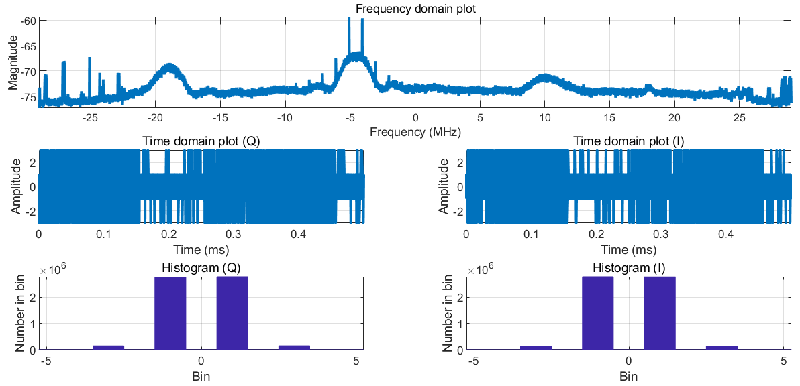
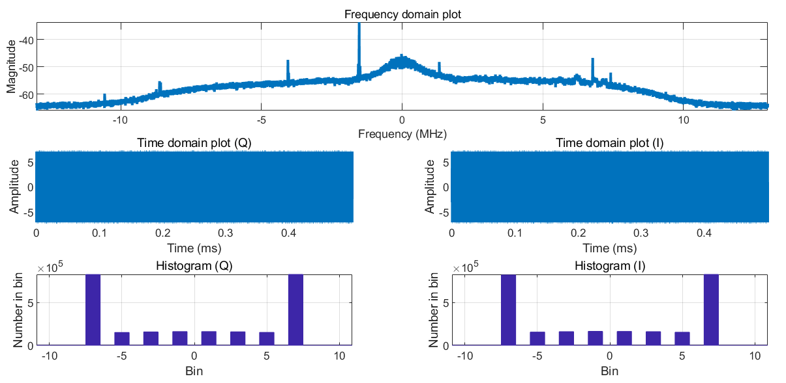
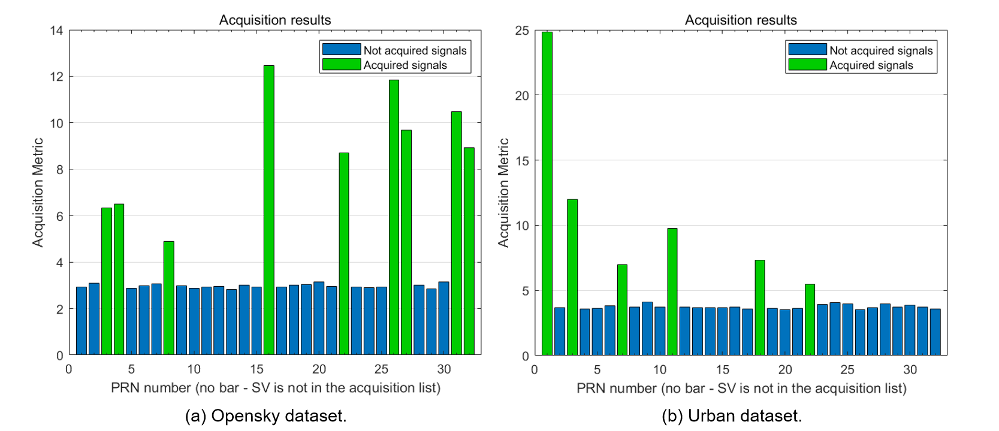
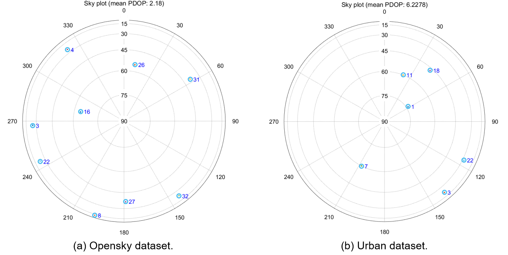
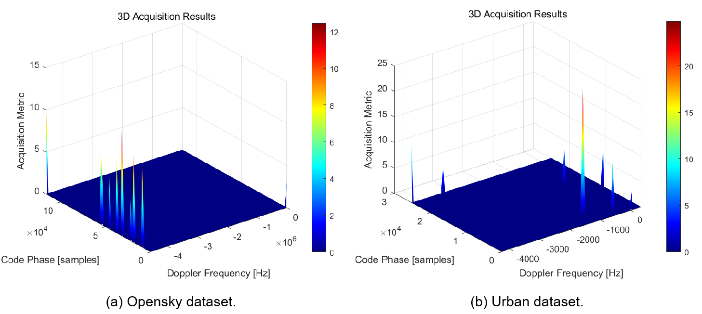

# AAE6102-Assignment1
In this work, we process and analyze the IF data using an open-source GNSS-SDR code ([GitHub link](https://github.com/perrysou/GNSS_SDR)). Two different real Intermediate Frequency (IF) dataset are considered, one is collected in open-sky and the other in the urban environment. The datasets are downloaded and saved in `data` folder, name as `Opensky.bin` and `Urban.dat` separately.

## Task 1 - Acquisition
### <font color=#3399ff>1.1 Task Description</font>
Process the IF data using a GNSS SDR and generate initial acquisition outputs. 
### <font color=#3399ff>1.2 Method</font>
The information of the given datasets are shown in the following table  
|         |     Opensky       |     Urban       |
|----------------|-------------------|------------------|
| Carrier frequency | 1575.42 MHz      | 1575.42 MHz      |
| Intermediate frequency | 4.58 MHz      | 0                |
| Sampling frequency | 58 MHz          | 26 MHz           |
| Data Format    | 8 bit I/Q samples | 8 bit I/Q samples |
| Ground truth   | (22.3284477008575, 114.171630049711) | (22.3198722, 114.2091017778) |
| Data length    | 90 seconds        | 90 seconds       |
||

The chosen open-source GNSS-SDR is utilized for data acquisition. The `initSettings.m` file has been adjusted in accordance with the table above. In the section labeled `%Raw signal file name and other parameters`, the file path to the downloaded dataset and the relevant parameters are configured. The following partial code illustrates this refined section.
#### <font color=#3399ff>A. Opensky</font>
```
settings.fileName           = '..\Assignment-1\data\Opensky.bin';
% Data type used to store one sample
settings.dataType           = 'int8';             
settings.fileType           = 2;

% Intermediate, sampling and code frequencies
% settings.IF                 = -1580e6+1575.42e6;     % 4.58M[Hz]
% settings.samplingFreq       = 58e6;        % [Hz]
% settings.codeFreqBasis      = 1.023e6;     % [Hz]
```
#### <font color=#3399ff>B. Urban</font>
```
settings.fileName           = '..\Assignment-1\data\Urban.dat';
% Data type used to store one sample
settings.dataType           = 'int8';  

% Intermediate, sampling and code frequencies
settings.IF                 = 0;     % 0 [Hz]
settings.samplingFreq       = 26e6;        % [Hz]
settings.codeFreqBasis      = 1.023e6;     % [Hz]

```

### <font color=#3399ff>1.3 Results and Analysis</font>
The initial acquisition results are generated according to the following steps (codes related to `acquisition.m`):
1) Load the raw IF data to matlab workspace, the results are illustrated in Fig.1.
2) Set the acquisition threshold to select and determine useful satellites. The final acquisition results are shown in Fig.2.


<center><font size='2'>(a) Opensky dataset</font></center>


<center><font size='2'>(b) Urban dataset</font></center>

<center><font>Fig.1 The illustration of loaded raw IF data.</font></center>




<center><font>Fig.2 The data acquisition results.</font></center>

In Fig.2, the blue bars show the signals that are not required and the green ones related to acquired signals. For the Opensky dataset, 9 satellites are selected while for the Urban dataset, 6 satellites are selected. Fig.3 further illustrated the relationship between acquisition metric with the code phase and the doppler frequency, where the code phase is used to generate a local PRN code to align with the incoming code.

<center><font>Fig.3 The illustration of the relationship between acquisition metric with the code phase and the doppler frequency.</font></center>


## Task 2 - Tracking
### <font color=#3399ff>2.1 Task Description</font>
Adapt the tracking loop (DLL) to produce correlation plots and analyze the tracking performance. (Multiple correlators must be implemented for plotting the correlation function). Discuss the impact of urban interference on the correlation peaks.

### <font color=#3399ff>2.2 Method</font>
The tracking function is crucial for ensuring that a receiver can effectively track and process signals from multiple satellites, providing essential data for accurate positioning and navigation.

The tracking method is designed to perform code and carrier tracking for multiple satellite channels. To acheive the function of tracking, the `tracking.m` file is utilized in this section. The function tracks the signals from various satellites by adjusting the carrier frequency and code phase values. This is essential for maintaining accurate synchronization with satellite signals.
The function takes processed satellites signal record, including their PRN, carrier frequncies and code phases which can be generated from the acquired data in `Task-1`.

To satisfy the requirement of **Multiple correlators must be implemented for plotting the correlation function**. The utilized method implements the functionality of multiple correlators by setting up early, late, and prompt code vectors. Each correlator corresponds to a different code phase, thereby enhancing the accuracy and robustness of signal tracking. This approach allows the receiver to adjust its tracking strategy more flexibly in response to signal variations. The following codes show the definition of the mentioned multiple correlators.
```
%%%% Early Code Vector %%%
tcode = (remCodePhase - earlyLateSpc) : codePhaseStep : ((blksize - 1) * codePhaseStep + remCodePhase - earlyLateSpc);
tcode2 = ceil(tcode) + 1;
earlyCode = caCode(tcode2);
```
```
%%% Late Code Vector %%%
tcode = (remCodePhase + earlyLateSpc) : codePhaseStep : ((blksize - 1) * codePhaseStep + remCodePhase + earlyLateSpc);
tcode2 = ceil(tcode) + 1;
lateCode = caCode(tcode2);
```
```
%%% Prompt Code Vector %%%
tcode = remCodePhase : codePhaseStep : ((blksize - 1) * codePhaseStep + remCodePhase);
tcode2 = ceil(tcode) + 1;
promptCode = caCode(tcode2);
```


The function will output in-phase promt outputs, absolute starting positions of the spreading codes, and other observation data, which will be analyze in next subsection.


### <font color=#3399ff>2.3 Results and Analysis</font>
### <font color=#3399ff>2.3.1 Opensky</font>
**PRN 26** is selected as an example to analyze the tracking results of Opensky dataset. It can be observed from Fig.4 that the Q-channel approaches zero, which verifies that the carrier phase is properly aligned.
<center></center>
<center><font>Fig.4 Plot of discrete-time scattering of the Opensky dataset.</font></center>
Since the track loop (DLL) method is used in this project, the raw and filtered DLL discriminator results are illustrated in Fig.5. The results show that the output stays near zero value, meaning that the local code is aligned with the code phase of the received signal with less tracking error.
<center></center>
<center><font>Fig.5 Plots of DLL discriminator.</font></center>
Analyze from the correlation results shown in Fig.6, the correlation of the Prompt is notably higher than that of Early/Late, suggesting that the code phases are accurately aligned and that the DLL is in a stable tracking condition.
<center></center>
<center><font>Fig.6 Illustration of the correlation results.</font></center>


### <font color=#3399ff>2.3.1 Urban</font>
**PRN 11** is selected as an example to analyze the tracking results of Urban dataset. Compared to the result of the opensky data in Fig.4, the distribution of Q-chennal value shown in Fig.7 is more spread out, although it still seems centering around zero. This demonstrated that the carrier phase in the Urban dataset is not aligned well, since not all energy are concentrated on I-channel.
<center></center>
<center><font>Fig.7 Plot of discrete-time scattering of the Opensky dataset.</font></center>
The DLL outputs are with slight unstable amplitude.
<center></center>
<center><font>Fig.8 Plots of DLL discriminator.</font></center>
It is illustrated in Fig.9 that the difference between the Prompt correlation and Early/Late are not so significant, which opposites the expectated results. This demonstrated again that the carrier phase is not well aligned.
<center></center>
<center><font>Fig.9 Illustration of the correlation results.</font></center>


## Task 3 - Navigation data decoding
### <font color=#3399ff>3.1 Task Description</font>
Decode the navigation message and extract key parameters, such as ephemeris data, for at least one satellite.
### <font color=#3399ff>3.2 Method</font>
After tracking all the selected satellites, the data decoding block `postNavigation.m` and `NAVdecoding.m` utilizes the output from the tracking module to transform the processed tracking information into ephemeris for GPS constellations. It first identifies the preambles before proceeding to decode the ephemeris for the corresponding constellation. 
### <font color=#3399ff>3.3 Results and Analysis</font>
Fig. 10(a) and (b) illustrate the navigation information decoded from the signal of Opensky and Urban datasets respectively. The plot in Fig.(b) shows unstable amplitude, illustrating that the energy is not concentrated on I-channel. Therefore, the signals are not well tracked in urban area than in the open sky. 

<center></center>
<center><font>Fig.10 Illustration of the correlation results.</font></center>
Take the Urban dataset as an example, the corresponding decoded ephemeris data is shown in Fig.11, where there exist 6 satellites. 
<center></center>
<center><font>Fig.11 Table of the decoded ephemeris data of the Urban dataset.</font></center>


## Task 4 - Position and velocity estimation 
### <font color=#3399ff>4.1 Task Description</font>
1) Using the pseudorange measurements obtained from tracking, implement the Weighted Least Squares (WLS) algorithm to compute user’s position and velocity.
2) Plot the user position and velocity, compare it to the provided ground truth values
3) comment on the impact of multipath effects on the WLS solution.
### <font color=#3399ff>4.2 Method</font>
- First, use `calculatePseudoranges.m` in the `Common` folder to calculate the pseudoranges. 
- Then, use `satpos.m` to calculate satellites positions and clocks corrections.
- Finally, use `leastSquarePos.m` to calculate the receiver position and speed, where the WLS algorithm is introduced.

As the original code only has LS algorithm, so the original `leastSquarePos.m` is edited to satisfy the capability of WLS algorithm. The correlated changes are sum up as follows.
```
%%% Weight updating in the loop %%%

weight(i)=sin(el(i))^2;
```
```
%%% position calculation %%%

W=diag(weight);
C=W'*W;
x=(A'*C*A)\(A'*C*omc);
```
Besides, the velocity calculating module is designed as follows.
```
%%% receiver velocity calculation %%%
b=[];
lamda=settings.c/1575.42e6;
rate=(-lamda*doppler)';
satvelocity=satvelocity';

for i=1:nmbOfSatellites
    b(i)=rate(i)-satvelocity(i,:)*(A(i,1:3))';
end

v=(A'*C*A)\(A'*C*b');
```
### <font color=#3399ff>4.3 Results and Analysis</font>
The function `postNavigation` takes `trackResults` as input to calculate navigation solutions for the receiver, and it converts the coordinates from the WGS84 system to UTM. The transform results of both the Opensky and Urban datasets are shown in Fig.12.
<center></center>
<center><font size='2'>(a) Opensky dataset.</font></center>
<center></center>
<center><font size='2'>(b) Urban dataset.</font></center>
<center><font>Fig.12 The calculated coordinates variations in UTM systems.</font></center>

The calculated user position results of the Opensky and the Urban dataset are shown in Fig.13. It is demonstrated in Fig.13 that the position error of the Opensky dataset is much more less than the Urban dataset. The calculated result of Opensky dataset utilizing the WLS algorithm shows close alignment to the ground truth, which is shown in Fig.13(a) with a red cross.
<center></center>
<center><font size='2'>(a) Opensky dataset.</font></center>
<center></center>
<center><font size='2'>(b) Urban dataset.</font></center>
<center><font>Fig.13 Illustration of the calculated user positioning results.</font></center>

The user velocity is summarized in Fig. 14.
<center></center>
<center><font size='2'>(a) Opensky dataset.</font></center>
<center></center>
<center><font size='2'>(b) Urban dataset.</font></center>
<center><font>Fig.14 Illustration of the calculated user velocity results.</font></center>

### <font color=#3399ff>4.3 Impact of multipath effects on the WLS solution</font>
Based on the previous analysis, the user's position calculated from the Opensky dataset aligns perfectly with the ground truth coordinates. In contrast, a noticeable discrepancy is evident in the Urban dataset. This is primarily due to multipath effects caused by GPS signals reflecting off tall buildings, which results in these signals traveling longer distances than the direct line-of-sight signals. Consequently, this negatively impacts the accuracy of the user's antenna position determination. Additionally, the presence of multipath signals can cause the estimated position to fluctuate significantly when these signals reach the antenna shortly after the direct signals, leading to unrealistically high velocity estimates. In comparison, the velocity values in the Opensky dataset remain more realistic. The multipath effect can also contribute to instability in velocity estimates, such as abrupt drops in speed at specific time intervals.

Moreover, the reduced accuracy associated with multipath effects can be attributed to the traditional scalar tracking loops striving to achieve E=L. This often results in biases in the prompt tracking point, leading to errors in range measurements. Therefore, when multipath effects are present, a significant difference between the estimated user position (from the WLS solution) and the actual ground truth coordinates is likely to be observed.


## Task 5 - Kalman filter-based positioning
### <font color=#3399ff>5.1 Task Description</font>
Develop an Extended Kalman Filter (EKF) using pseudorange and Doppler measurements to estimate user position and velocity.
### <font color=#3399ff>5.2 Method</font>


### <font color=#3399ff>5.3 Results and Analysis</font>


## Resources
Thanks to the work of [A Software-Defined GPS and Galileo Receiver: A Single-Frequency Approach](https://github.com/perrysou/GNSS_SDR).